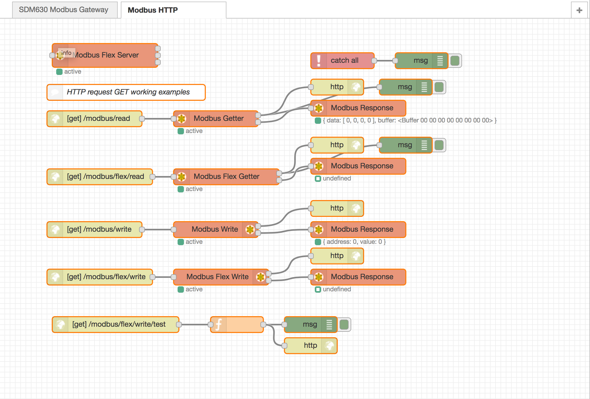

node-red-contrib-modbus 
========================

#### The all in one Modbus TCP and Serial contribution package for Node-RED.

[Node-RED][1] contribution package for [Modbus][8]

## [Become a backer of the project straight away!][11]

Based on [modbus-serial][2] with TCP, C701, Telnet, Serial, RTU buffered, and ASCII

* stress tested with Node-RED v0.17.5 and Node.js v6.x and v8.x LTS
* works with queueing per unit and round robin scheduling
* Node.JS 4.x is supported with v1.x

# Install

Run the following command in the root directory of your Node-RED install

    npm install node-red-contrib-modbus

Run the following command for global install

    npm install -g node-red-contrib-modbus

try these options on npm install to build, if you have problems to install

    --unsafe-perm --build-from-source
    
# Update/Upgrade/Downgrade

To update the dependencies or the whole package, you have just to install again.
To get a special version please set the version with @M.M.F:

    npm install node-red-contrib-modbus@1.3.0

or global by

    npm install -g node-red-contrib-modbus@1.3.0
    
# How to use

see [Wiki][10] pages

use the [Flow example][3] to see how it works ...

see [YouTube Playlist][9]

# Debug

Debug will be activated by starting Node-RED with debug mode: 

    DEBUG=contribModbus*,modbus-serial node-red -v

    or

    DEBUG=contribModbus:{option},contribModbus:{option},...

## Options

 * core
    * core:client
 * read
 * write
 * server
 * response
 * flex
    * flex:getter
    * flex:write
    * flex:connector
    * flex:server
 * modbus-serial

see [Wiki][10] pages to get more options in detail

# Authors

since April 2016 by [Klaus Landsdorf][4]

### History 

* contribution in 2016 by [iurly][6]

* license changed in 2016 by [Jason D. Harper][7]

* started in early 2015 by [Mika Karaila][5]

[1]:https://nodered.org
[2]:https://www.npmjs.com/package/modbus-serial
[3]:https://flows.nodered.org/flow/bf06a87e84395e4bce276714c6f5f884
[4]:https://github.com/biancode
[5]:https://github.com/mikakaraila
[6]:https://github.com/iurly
[7]:https://github.com/jayharper
[8]:http://www.modbus.org/
[9]:http://bit.ly/2jzwjqP
[10]:https://github.com/biancode/node-red-contrib-modbus/wiki
[11]:https://bianco-royal.cloud/supporter/
