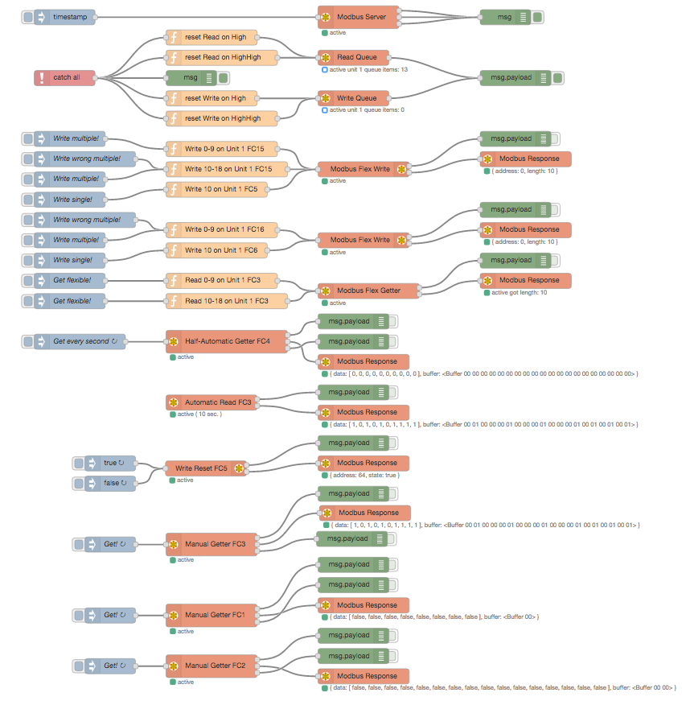

node-red-contrib-modbus 
========================

[Node-RED][1] contribution package for [Modbus][8]

Based on [modbus-serial][2] with TCP and Serial RTU, RTU buffered, C701, Telnet, ASCII

* stress tested with Node-RED v0.15.2/v0.16.1 and Node.js (4.7/6.9 LTS)
* works with queueing per unit and round robin scheduling

# Install

Run the following command in the root directory of your Node-RED install

    npm install node-red-contrib-modbus

Run the following command for global install

    npm install -g node-red-contrib-modbus

try these options on npm install to build, if you have problems to install

    --unsafe-perm --build-from-source
    
# How to use

use the [Flow example][3] to see how it works ...

see [YouTube Playlist][9]

# Authors

since April 2016 by [Klaus Landsdorf][4]

History started in early 2015 by [Mika Karaila][5]
license changed in 2016 by [Jason D. Harper][7]
contribution in 2016 by [iurly][6]

[1]:https://nodered.org
[2]:https://www.npmjs.com/package/modbus-serial
[3]:https://flows.nodered.org/flow/bf06a87e84395e4bce276714c6f5f884
[4]:https://github.com/biancode
[5]:https://github.com/mikakaraila
[6]:https://github.com/iurly
[7]:https://github.com/jayharper
[8]:http://www.modbus.org/
[9]:http://bit.ly/2jzwjqP
