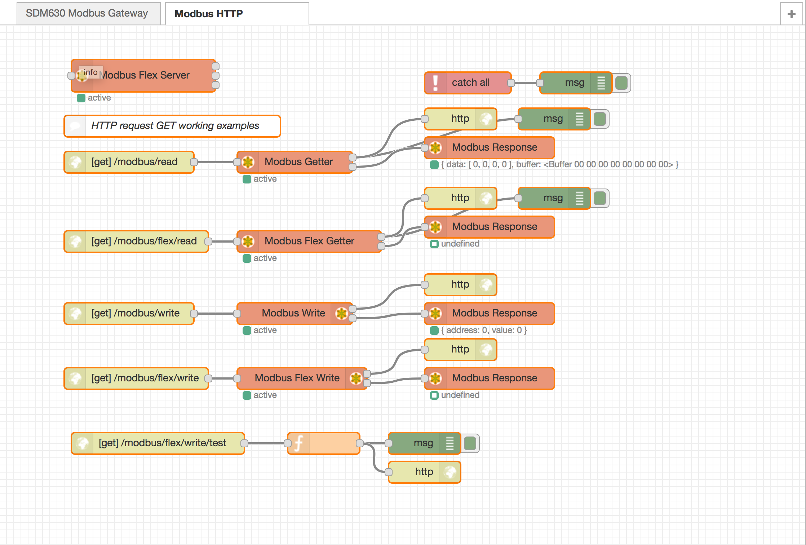

[](https://opencollective.com/node-red-contrib-modbus)
[](https://www.npmjs.com/package/node-red-contrib-modbus)


[](http://standardjs.com/)
[](https://npm-stat.com/charts.html?package=node-red-contrib-modbus)
[](https://github.com/BiancoRoyal/node-red-contrib-modbus/actions/workflows/build.yml)
[](https://www.codacy.com/gh/BiancoRoyal/node-red-contrib-modbus?utm_source=github.com&amp;utm_medium=referral&amp;utm_content=BiancoRoyal/node-red-contrib-modbus&amp;utm_campaign=Badge_Grade)
[](https://gitpod.io/#https://github.com/BiancoRoyal/node-red-contrib-modbus)
[](https://claude.ai/code)


# node-red-contrib-modbus

### The all-in-one Modbus TCP and Serial contribution package for Node-RED

[](https://www.npmjs.com/package/node-red-contrib-modbus)

**Public LTS line:** **v5.x** (current: **5.60.2**) · License **BSD-3-Clause** · Repo: [GitHub][12]

If you like this package, please **give us a star on [GitHub][12]**.

> **AI-assisted maintenance:** This project is **actively developed and supported with [Claude Code Pro](https://claude.ai/code)** (Anthropic). Issue triage, specs, tests, and patches on the v5 LTS line are routinely done with Claude Code as part of the maintainer workflow — alongside human review before release.

---

## Requirements

| | Minimum |
|--|---------|
| **Node.js** | `>= 22` ([`package.json` engines](package.json)) |
| **Node-RED** | `>= 4` ([`node-red.version`](package.json)) |
| **Install** | Palette Manager or `npm install node-red-contrib-modbus` |

Older Node.js / Node-RED combinations: see historical notes in [HISTORY.md](HISTORY.md). Prefer staying on current LTS Node.js with this release line.

---

## What’s in the package (v5)

TCP / serial Modbus **client** nodes plus an in-package **buffer Modbus TCP server** for demos and tests.

| Palette node | Role |
|--------------|------|
| **Modbus-Client** | Config: TCP or Serial, queue, reconnect (XState FSM) |
| **Modbus-Read** | Periodic FC1–4 poll |
| **Modbus-Getter** | On-demand FC1–4 read |
| **Modbus-Flex-Getter** | Payload-driven FC1–4 read |
| **Modbus-Write** | FC5 / 6 / 15 / 16 write |
| **Modbus-Flex-Write** | Payload-driven write |
| **Modbus-Flex-Sequencer** | Ordered multi-range reads |
| **Modbus-Flex-FC** | Custom FC maps (`extras/argumentMaps`) |
| **Modbus-Flex-Connector** | Runtime reconnect / endpoint switch |
| **Modbus-Queue-Info** | Client queue depth / reset |
| **Modbus-Response** | Status display for responses |
| **Modbus-IO-Config** | Named IO JSON mapping |
| **Modbus-Response-Filter** | Filter IO payload by name |
| **Modbus-Server** | Buffer-backed TCP slave (jsmodbus) |

**Not in v5:** TLS client (`Modbus-Client-TLS` is v6), flow-based dynamic request/response gateway ([#567](https://github.com/BiancoRoyal/node-red-contrib-modbus/issues/567) → separate package recommendation), `modbus-flex-server` (own package — see below).

### Highlights since 5.46 / in 5.50.0

- Client **FSM / reconnect / queue** hardening (from 5.46.x)
- Safer **unit ID** handling (`unitId` / `unitid`, including unit `0`)
- Modbus address/quantity validation improvements
- Numbered **learning examples** `01`…`18` + [Learning Path docs](docs/LEARNING-PATH.md)
- **Requires Node-RED `>= 4`** and **Node.js `>= 22`**

See [CHANGELOG.md](CHANGELOG.md) for the full list.

---

## How to use / Learning Path

**Recommended:** use the in-package **numbered learning examples** (`01` … `15`).

1. Install this package and restart Node-RED.
2. Open **Menu → Import → Examples → `node-red-contrib-modbus`**.
3. Work through the flows in order (or jump to a single node tutorial).

| Doc | Content |
|-----|---------|
| [**Learning Path guide**](docs/LEARNING-PATH.md) | Stages, Modbus cheat sheet, node ↔ example map |
| [**Examples index**](examples/README.md) | Full file list, TCP ports, IO path, old→new mapping |
| [Docs hub](docs/README.md) | All documentation entry points |

Each example tab has an English **comment** node with run instructions. Node sidebar help points at the matching example filename.

| Learn… | Import example |
|--------|----------------|
| Modbus registers & FCs | `01-Modbus-Basics-Registers-And-FCs` |
| First TCP client + server | `02-Getting-Started-Client-And-Server` |
| Polling / on-demand / flex read-write | `03` … `06` |
| Sequencer, Flex-FC, Connector, Queue, IO | `07` … `11` |
| Buffer server & patterns (HTTP, serial, gateway) | `12` … `15` |

Also: [Wiki / DEBUG][10] · [YouTube Playlist][9] · [Leanpub Modbus book](https://leanpub.com/p4nr-contribution-modbus/) · optional older flow on [flows.nodered.org][3]



---

## Install

In your Node-RED user directory (typically `~/.node-red`):

```bash
npm install node-red-contrib-modbus
```

Global (less common):

```bash
npm install -g node-red-contrib-modbus
```

If native modules fail to build:

```bash
npm install node-red-contrib-modbus --unsafe-perm --build-from-source
```

List published versions:

```bash
npm show node-red-contrib-modbus versions
```

Install a specific version (example):

```bash
npm install node-red-contrib-modbus@5.45.2
```

### Runtime libraries

| Package | Role in this contrib |
|---------|----------------------|
| [`@openp4nr/modbus-serial`][18] | Modbus client I/O (TCP / serial / ASCII, etc.) |
| [`jsmodbus`][13] | In-package **Modbus-Server** (buffer slave) |
| [`@xstate/fsm`][19] | Client connection state machine |
| [`serialport`][14] / `@serialport/list` | **Optional** — list serial ports in the UI (not the runtime Modbus stack) |

If TCP fails, verify connectivity with a plain Modbus client first. If serial fails, verify the port with [`serialport`][14] first.

Logging uses the [`debug`][20] package (not winston — winston is a v6 direction):

```bash
DEBUG=contribModbus*,modbus-serial node-red -v
```

More options: [Wiki DEBUG][10].

---

## Modbus Flex Server (separate package)

**Modbus-Flex-Server** was moved out of this package (vm2 / maintenance boundary). Install the dedicated contrib if you still need it. Further package splits (client vs server) remain a longer-term v6 architecture topic; **v5 keeps `Modbus-Server` in this package** as the buffer slave for demos and tests.

---

## P4NR B2B Community

The [P4NR B2B Community][16] (driven by [Iniationware][15]) supports development and commercial help around Modbus for Node-RED. Bianco Royal partners with P4NR.

- [PLUS for Node-RED International][16]
- [PLUS for Node-RED Germany][17]

### Leanpub live book

The [Online Leanpub Book](https://leanpub.com/p4nr-contribution-modbus/) (Edition 2 for **5.60+**, Node-RED 5 / Node.js 24) covers v5.x nodes and options in depth (“buy once, update forever”). For a free start in this repo, use the [**Learning Path**](docs/LEARNING-PATH.md) (examples `01`–`18`).

---

## Errors & status

From v5.22 onward, client and server nodes catch many network and protocol errors so Node-RED should not crash for those handled cases. Always watch **node status**, **Catch** nodes, and optional empty-msg-on-fail settings in your flows.

---

## Contributing

Contributors welcome. Fork the repo and open PRs against **`develop`** (or discuss via issues). For larger features, see the maintainer pipeline under [`docs/p4nr/`](docs/p4nr/README.md).

Useful scripts (see `package.json`):

```bash
npm run build          # lint + gulp → modbus/
npm test               # Mocha (parallel)
npm run test:units
npm run coverage
npm run dev-link       # local link into Node-RED
```

## Authors

Since April 2016 by [Klaus Landsdorf][4] and the community.

- Contribution since 2016: [Contributors][6]
- License change 2016: [Jason D. Harper][7]
- Started early 2015: [Mika Karaila][5]

[Version history](HISTORY.md) · [CHANGELOG](CHANGELOG.md)

---

## Contributors

### Code Contributors

This project exists thanks to all the people who contribute. [[Contribute](CONTRIBUTING.md)].
<a href="https://github.com/BiancoRoyal/node-red-contrib-modbus/graphs/contributors"></a>

### Financial Contributors

Become a financial contributor and help us sustain our community. [[Contribute](https://opencollective.com/node-red-contrib-modbus/contribute)]

#### Individuals

<a href="https://opencollective.com/node-red-contrib-modbus"></a>

#### Organizations

Support this project with your organization. Your logo will show up here with a link to your website. [[Contribute](https://opencollective.com/node-red-contrib-modbus/contribute)]

<a href="https://opencollective.com/node-red-contrib-modbus/organization/0/website"></a>
<a href="https://opencollective.com/node-red-contrib-modbus/organization/1/website"></a>
<a href="https://opencollective.com/node-red-contrib-modbus/organization/2/website"></a>
<a href="https://opencollective.com/node-red-contrib-modbus/organization/3/website"></a>
<a href="https://opencollective.com/node-red-contrib-modbus/organization/4/website"></a>
<a href="https://opencollective.com/node-red-contrib-modbus/organization/5/website"></a>
<a href="https://opencollective.com/node-red-contrib-modbus/organization/6/website"></a>
<a href="https://opencollective.com/node-red-contrib-modbus/organization/7/website"></a>
<a href="https://opencollective.com/node-red-contrib-modbus/organization/8/website"></a>
<a href="https://opencollective.com/node-red-contrib-modbus/organization/9/website"></a>

[1]:https://nodered.org
[2]:https://www.npmjs.com/package/modbus-serial
[3]:https://flows.nodered.org/flow/bf06a87e84395e4bce276714c6f5f884
[4]:https://github.com/biancode
[5]:https://github.com/mikakaraila
[6]:https://github.com/BiancoRoyal/node-red-contrib-modbus/graphs/contributors
[7]:https://github.com/jayharper
[8]:http://www.modbus.org/
[9]:http://bit.ly/2jzwjqP
[10]:https://github.com/BiancoRoyal/node-red-contrib-modbus/wiki/DEBUG
[11]:https://plus4nodered.com/
[12]:https://github.com/BiancoRoyal/node-red-contrib-modbus
[13]:https://www.npmjs.com/package/jsmodbus
[14]:https://www.npmjs.com/package/serialport
[15]:https://iniationware.com/
[16]:https://plus4nodered.com/
[17]:https://plus4nodered.com/de/
[18]:https://github.com/openp4nr/modbus-serial
[19]:https://www.npmjs.com/package/@xstate/fsm
[20]:https://www.npmjs.com/package/debug
