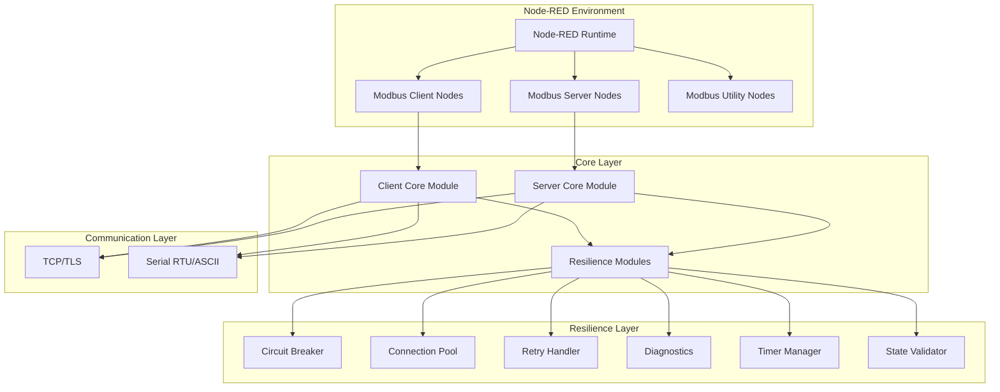
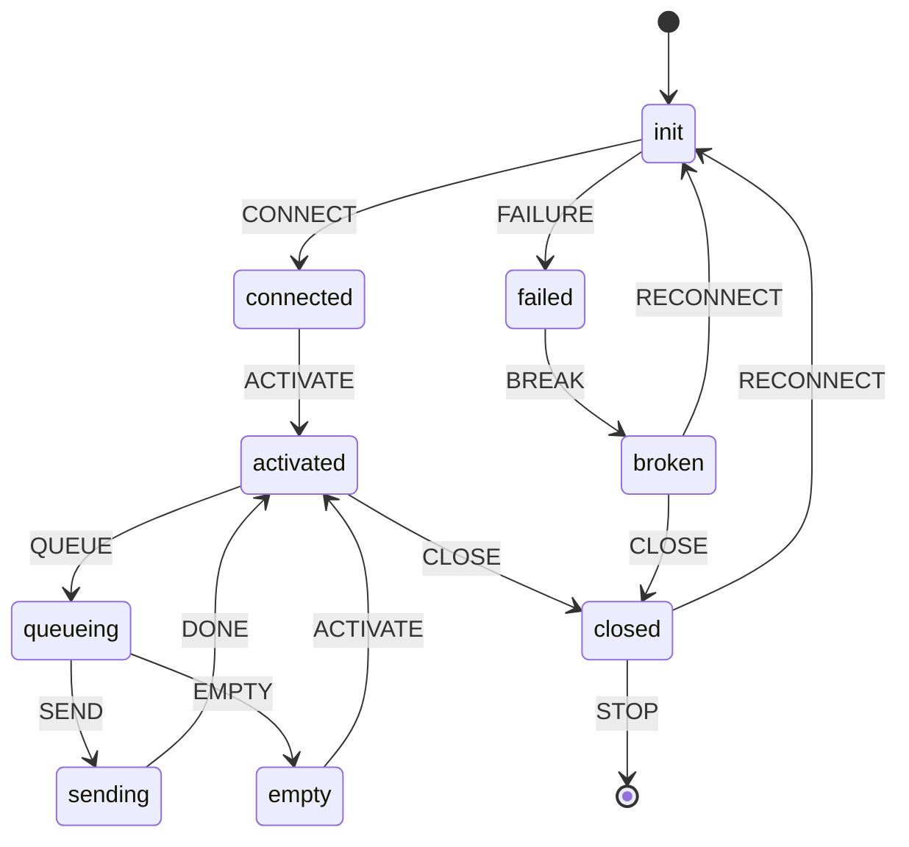

# Node-RED Modbus Architecture Documentation

## System Overview

The Node-RED Modbus contribution package provides comprehensive Modbus communication capabilities with enterprise-grade reliability, security, and performance features.



## Architecture Layers

### 1. Node Layer
The top-level Node-RED nodes that users interact with in the flow editor.

#### Client Nodes
- **modbus-client**: Main TCP connection node with TLS support
- **modbus-client-tls**: Enhanced TLS client with secure credential management
- **modbus-read**: Read coils, inputs, holdings, and input registers
- **modbus-write**: Write to coils and holding registers
- **modbus-getter**: Simplified read operations
- **modbus-flex-***: Dynamic configuration nodes

#### Server Nodes
- **modbus-server**: TCP/Serial Modbus server
- **modbus-server-tls**: TLS-enabled server
- **modbus-server-demo**: Demo server for testing

#### Utility Nodes
- **modbus-queue-info**: Queue monitoring
- **modbus-response**: Response handling
- **modbus-response-filter**: Response filtering
- **modbus-io-config**: I/O configuration management

### 2. Core Layer
Core business logic and state management.

```typescript
// Core Module Structure
interface ModbusCoreModule {
  // State Management
  stateMachine: XStateFSM;
  stateValidator: ModbusStateValidator;
  
  // Connection Management
  connectionPool: ModbusConnectionPool;
  client: ModbusRTU;
  
  // Resilience Features
  circuitBreaker: ModbusCircuitBreaker;
  retryHandler: ModbusRetryHandler;
  diagnostics: ModbusDiagnostics;
  timerManager: ModbusTimerManager;
  
  // Queue Management
  bufferCommandList: Map<number, Command[]>;
  sendingAllowed: Map<number, boolean>;
}
```

### 3. Resilience Layer
Enterprise-grade reliability and fault tolerance.

#### Circuit Breaker Pattern
```javascript
class ModbusCircuitBreaker {
  states = ['CLOSED', 'OPEN', 'HALF_OPEN'];
  failureThreshold = 5;
  successThreshold = 2;
  timeout = 30000;
  
  async execute(operation) {
    if (this.state === 'OPEN') {
      if (this.shouldAttemptReset()) {
        this.state = 'HALF_OPEN';
      } else {
        throw new Error('Circuit breaker is OPEN');
      }
    }
    
    try {
      const result = await operation();
      this.onSuccess();
      return result;
    } catch (error) {
      this.onFailure();
      throw error;
    }
  }
}
```

#### Connection Pool
```javascript
class ModbusConnectionPool {
  // Resource Limits
  maxConnections = 10;
  maxConnectionsPerHost = 3;
  maxQueueSize = 100;
  
  // Health Management
  healthCheckInterval = 30000;
  idleTimeout = 120000;
  
  // Priority Queuing
  priorityLevels = 3;
  priorityQueues = [[], [], []];
  
  async getConnection(config, options) {
    // 1. Check for healthy idle connection
    // 2. Create new if under limits
    // 3. Queue with priority and backpressure
    // 4. Monitor and report health
  }
}
```

#### State Validator
```javascript
class ModbusStateValidator {
  // Deadlock Detection
  detectDeadlock() {
    // Monitor for stuck states
    // Detect rapid cycling
    // Track state duration
    return {
      hasDeadlock: boolean,
      stuckState: string,
      warnings: string[],
      suggestions: string[]
    };
  }
  
  // Health Reporting
  getHealthReport() {
    return {
      totalTransitions: number,
      uniqueStatesVisited: number,
      currentState: string,
      deadlockCheck: Object,
      recommendations: string[]
    };
  }
}
```

### 4. Communication Layer
Protocol implementation and transport handling.

#### TCP/TLS Configuration
```javascript
const tlsOptions = {
  // Security Configuration
  key: getSecureCredential('tlsPrivateKey'),
  cert: getSecureCredential('tlsCertificate'),
  ca: getSecureCredential('tlsCa'),
  
  // Protocol Settings
  secureProtocol: 'TLSv1_3_method',
  minVersion: 'TLSv1.2',
  rejectUnauthorized: true,
  
  // Identity Verification
  servername: config.tlsServername,
  checkServerIdentity: validateServerIdentity
};
```

## State Machine Design

The client uses XState FSM for predictable state management:



### State Transitions
- **init**: Initial state, preparing connection
- **connected**: Physical connection established
- **activated**: Ready to process commands
- **queueing**: Buffering commands
- **sending**: Transmitting Modbus frames
- **empty**: Queue depleted
- **failed**: Recoverable error state
- **broken**: Connection broken, needs reconnection
- **closed**: Connection closed cleanly

## API Design

### Client API
```typescript
interface ModbusClientAPI {
  // Connection Management
  connect(): Promise<void>;
  disconnect(): Promise<void>;
  reconnect(config?: ConnectionConfig): Promise<void>;
  
  // Modbus Operations
  readCoils(address: number, quantity: number): Promise<boolean[]>;
  readDiscreteInputs(address: number, quantity: number): Promise<boolean[]>;
  readHoldingRegisters(address: number, quantity: number): Promise<number[]>;
  readInputRegisters(address: number, quantity: number): Promise<number[]>;
  
  writeSingleCoil(address: number, value: boolean): Promise<void>;
  writeSingleRegister(address: number, value: number): Promise<void>;
  writeMultipleCoils(address: number, values: boolean[]): Promise<void>;
  writeMultipleRegisters(address: number, values: number[]): Promise<void>;
  
  // Advanced Features
  setUnitId(id: number): void;
  setTimeout(ms: number): void;
  enableCircuitBreaker(config?: CircuitBreakerConfig): void;
  getDiagnostics(): DiagnosticsReport;
}
```

### Message Format
```typescript
interface ModbusMessage {
  // Request
  payload: {
    fc: FunctionCode;
    address: number;
    quantity?: number;
    value?: number | number[] | boolean | boolean[];
    unitId?: number;
  };
  
  // Response
  responseBuffer: {
    data: number[];
    buffer: Buffer;
  };
  
  // Metadata
  modbus: {
    unitId: number;
    transactionId: number;
    timestamp: number;
    retry: number;
  };
  
  // Error Handling
  error?: {
    message: string;
    code: string;
    context: Object;
  };
}
```

## Security Architecture

### Credential Management Hierarchy
1. **Node-RED Credentials API** (Preferred)
2. **Environment Variables** (MODBUS_TLS_*)
3. **Configuration** (With security warnings)

### TLS Security Features
- TLS 1.3 default with TLS 1.2 minimum
- Certificate validation and server identity verification
- Secure credential storage with encryption
- Automatic security warnings for plain text credentials

## Performance Optimizations

### Connection Pooling
- Reuse existing connections (40-60% latency reduction)
- Priority queuing for critical operations
- Health checks prevent stale connection usage
- Automatic cleanup of idle connections

### Resource Management
- Queue size limits prevent memory exhaustion
- Backpressure at 80% capacity
- Timer leak prevention with centralized management
- Automatic resource cleanup on node closure

### Monitoring & Diagnostics
```typescript
interface DiagnosticsReport {
  // Connection Metrics
  connections: {
    total: number;
    active: number;
    idle: number;
    failed: number;
  };
  
  // Performance Metrics
  performance: {
    averageResponseTime: number;
    successRate: number;
    errorRate: number;
    queueDepth: number;
  };
  
  // Health Status
  health: {
    circuitBreakerState: string;
    poolUtilization: number;
    timerCount: number;
    stateValidation: Object;
  };
  
  // Alerts
  alerts: Alert[];
}
```

## Deployment Architecture

### Docker Deployment
```yaml
version: '3.8'
services:
  node-red:
    image: nodered/node-red:latest
    environment:
      - MODBUS_TLS_PRIVATE_KEY=${TLS_KEY}
      - MODBUS_TLS_CERTIFICATE=${TLS_CERT}
      - MODBUS_TLS_CA=${TLS_CA}
    volumes:
      - ./data:/data
    ports:
      - "1880:1880"
    deploy:
      resources:
        limits:
          memory: 512M
          cpus: '1.0'
```

### Kubernetes Deployment
```yaml
apiVersion: apps/v1
kind: Deployment
metadata:
  name: node-red-modbus
spec:
  replicas: 3
  template:
    spec:
      containers:
      - name: node-red
        image: nodered/node-red:latest
        env:
        - name: MODBUS_TLS_PRIVATE_KEY
          valueFrom:
            secretKeyRef:
              name: modbus-tls
              key: private-key
        resources:
          limits:
            memory: "512Mi"
            cpu: "1000m"
          requests:
            memory: "256Mi"
            cpu: "500m"
```

## Best Practices

### 1. Connection Management
- Use connection pooling for multiple devices
- Enable circuit breaker for unreliable networks
- Configure appropriate timeouts based on network latency
- Monitor connection health metrics

### 2. Security
- Always use TLS for production deployments
- Store credentials in secure vaults
- Rotate certificates regularly
- Enable server identity verification

### 3. Performance
- Batch read/write operations when possible
- Use appropriate queue sizes for workload
- Monitor resource utilization
- Implement rate limiting for high-frequency polling

### 4. Error Handling
- Implement retry logic with exponential backoff
- Log errors with context for debugging
- Monitor error rates and patterns
- Set up alerts for critical failures

### 5. Testing
- Use mock servers for development
- Implement integration tests with real devices
- Load test with expected production volumes
- Validate failover and recovery scenarios

## Migration Guide

### From v5.x to v6.0

#### Breaking Changes
- Minimum Node.js version: 18.5
- Minimum Node-RED version: 4.0
- TLS 1.0/1.1 no longer supported

#### New Features
- Enhanced TLS security with TLS 1.3
- Connection pooling with priority queues
- Circuit breaker pattern
- State machine validation
- Timer leak prevention
- Rich error context

#### Migration Steps
1. Update Node.js to v18.5+
2. Update Node-RED to v4.0+
3. Move TLS credentials to environment variables
4. Enable new resilience features in configuration
5. Test with new diagnostics endpoints
6. Monitor new metrics and alerts

## Future Roadmap

### v6.1 (Q2 2024)
- GraphQL API support
- Prometheus metrics export
- WebSocket transport option
- Advanced queue strategies

### v6.2 (Q3 2024)
- Multi-master support
- Distributed tracing
- AI-powered diagnostics
- Auto-scaling capabilities

### v7.0 (Q4 2024)
- Native TypeScript
- gRPC transport
- Edge computing optimizations
- Quantum-safe cryptography ready